# How (mis-)perceptions influence the acceptance of wind power deployment – can Energy Justice contribute to reaching a socio-technical tipping point?
This repository is based on work performed within the [HORIZON 2020 project WIMBY (Wind In My Backyard: Using holistic modelling tools to advance social awareness and engagement on large wind power installations in the EU)](https://cordis.europa.eu/project/id/101083460).

## Sentiment analysis of Twitter data
Particularly, this repository contains the scripts and some supporting data for the sentiment analysis of social media content. 

### Flowchart of the overarching process

Only 2% of tweets contains the geographical location through exac GPS coordinates ([van der Veen et al., 2015](https://doi.org/10.48550/arXiv.1508.02483)). 

### Cities & locations included in different countries (places_country.csv). 
We currently operate with an allowlist of places within a country, following the methodology of [Bruns et al. (2017)](https://doi.org/10.1177/2056305117748162). Due to data availability, the country allowlists have to be constructed and verified differently, based on what data is available. 

* For **Austria**, the places are sourced from [Wikipedia](https://en.wikipedia.org/wiki/List_of_cities_and_towns_in_Austria), and include NUTS2 and NUTS3 regions as well as municipalities (LAU2).
* For **Denmark**, the places include 243 urban areas (_byområder_) in English from [Wikipedia](https://en.wikipedia.org/wiki/List_of_cities_and_towns_in_Denmark), municipalities and regions (NUTS2) from [Danmarks Statistik](https://www.statistikbanken.dk/tabsel/199114), urban areas in Danish from [Wikipedia](https://da.wikipedia.org/wiki/Danmarks_st%C3%B8rste_byer) as well as provinces (NUTS3) from [Eurostat](https://ec.europa.eu/eurostat/web/gisco/geodata/reference-data/administrative-units-statistical-units/nuts). This totals to 321 locations for Denmark. 
* For **France**, the places are sourced from [Banatic](https://www.banatic.interieur.gouv.fr/V5/fichiers-en-telechargement/fichiers-telech.php) and available in English through the sublinks of [this Wikipedia page](https://en.wikipedia.org/wiki/Lists_of_communes_of_France). Currently, there is no verification of how much of the population is covered, however, it is known to be greater than 40%. With 6941 different locations, it is expected to be comprehensive. 
* For **Germany**, the list contain 2055 cities and towns, sourced from [Wikipedia](https://en.wikipedia.org/wiki/List_of_cities_and_towns_in_Germany) in combination with all NUTS1 (Bundesländer), NUTS2 (Regierungsbezirk) and NUTS3 (Landkreis). 
* For **Italy**, the places include all municipalities of the 107 provinces, resulting in 7817 places for Italy. These locations cover 100% of the population, according to data from [The Italian National Institute of Statistics](https://demo.istat.it/app/?i=D7B&a=2023&l=en)
* For **Ireland**, include cities, boroughs and towns in Ireland, as well as provinces and historical counties. Additionally, in order to minimise the number of tweets falsely assigned from other countries in English, we actively exclude [states and cities with a population over 50,000 in the U.S](https://www.census.gov/data/tables/time-series/demo/popest/2020s-total-cities-and-towns.html), 
* For **Norway**, the places include _townships_ of at least 200 people within 50 meter of one another and covers at least 82.67% of the population, based on numbers from [Statistics Norway](https://www.ssb.no/befolkning/folketall/statistikk/tettsteders-befolkning-og-areal). 
* For **Switzerland**, the places include all municipalities of Switzerland and cities of over 10,000 inhabitants. Data is sourced from [The Swiss Federal Statistical Office](https://www.bfs.admin.ch/bfs/en/home/basics/swiss-official-commune-register.assetdetail.6986904.html)

### Data overview
|             | Austria | Denmark | France | Germany | Italy | Ireland | Norway | Switzerland |
| ----------- | ----------- | ----------- | ----------- | ----------- | ----------- | ----------- | ----------- | ----------- |
| Raw tweets (language-based)               | 1,097,818 | 79,571  | 1,943,353 | 1,097,818 | 313,188 |     | 118,439 | CH |
| Excluded due to lack of geodata           | 368,722   | 22,515  | 648,304   | 368,722   | 114,351 |     | 31,769  | CH |
| Tweets with geolocation (language-based)  | 729,091   | 57,056  | 1,295,049 | 729,091   | 198,837 |     | 86,670  | CH |
| Tweets excluded due to illegible geodata  | 130,368   | 19,262  | 305,552   | 130,368   | 23,275  |     | 11,661  | CH |
| Final sample of tweets (country-based)    | 43,439    | 37,769  | 989,237   | 487,823   | 158,039 |     | 74,996  | CH |
| Number of unique users                    | 7,377     |         |           | 54,551    | 34,290  |     | 7,939   | CH |
| Highest number of tweets from single user | 2,887     |         |           | 14,347    | 2,638   |     | 2,533   | CH |
| Tweets per million inhabitants            | AT        | 6,451   | FR        | DE        | IT      | IE  | 13,880  | CH |

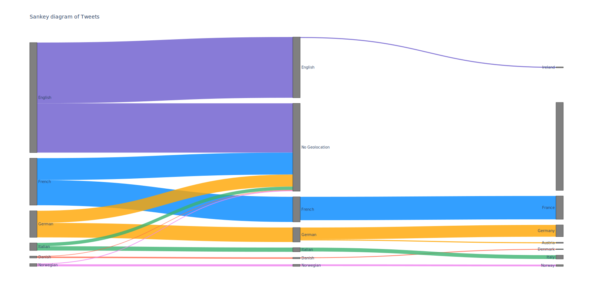

#### Austria
Duplicate cities removed: Altenburg, Auerbach, Berg, Bergheim, Burgau, Egg, Falkenstein, Friedberg, Krumbach, Lengenfeld, Lichtenberg, Liebenau, Meiningen, Moosburg, Mühldorf, Münster, Neunkirchen, Pottenstein,, Schlatt, Senftenberg, Stetten, Thal, Vals, Weißensee, Zell

Additionally, we remove 'Deutschlandsberg' because it gets assigned all locations which include 'Deutschland'. 

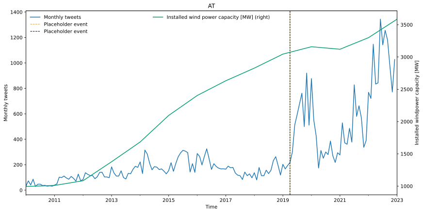

#### Denmark
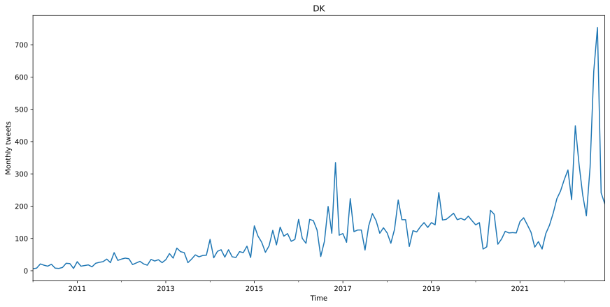
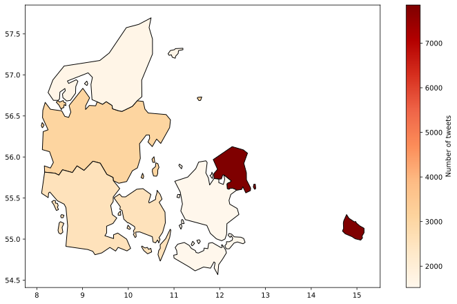

#### Germany
Duplicate cities removed: Altendorf, Frauenstein, Kirchberg, Speicher, Zell
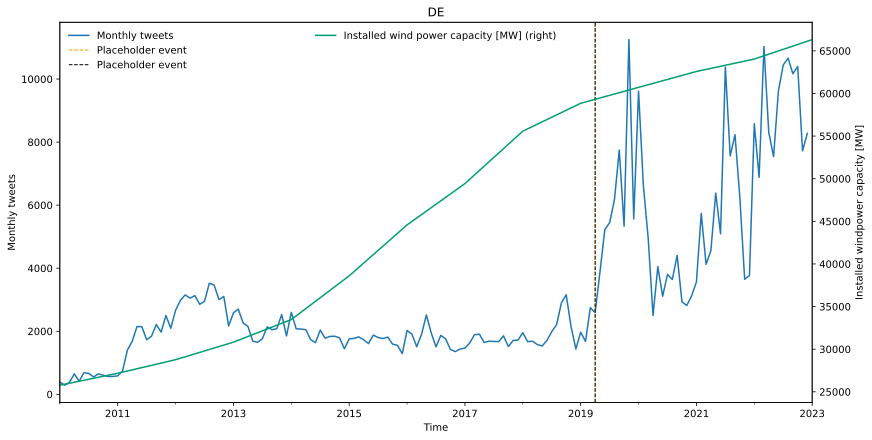
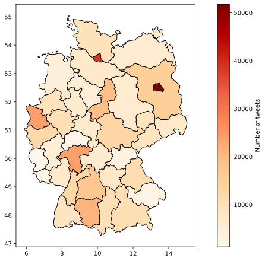

#### France
Duplicate cities removed: Aubonne, Berg, Bettlach, Breitenbach, Bulle, Cartigny, Chalais, Kappelen, Kirchberg, Lajoux, Lully, Perroy, St-Aubin, Saint-Barthélemy, Saint-Sulpice, Savigny, Tannay, Trimbach

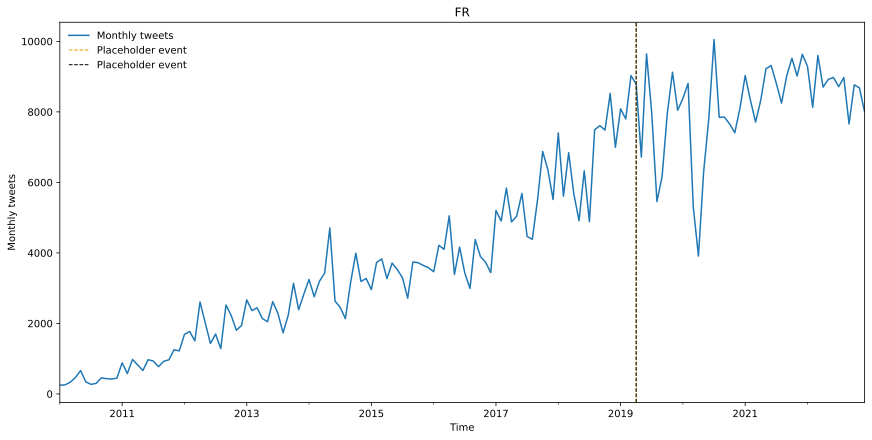
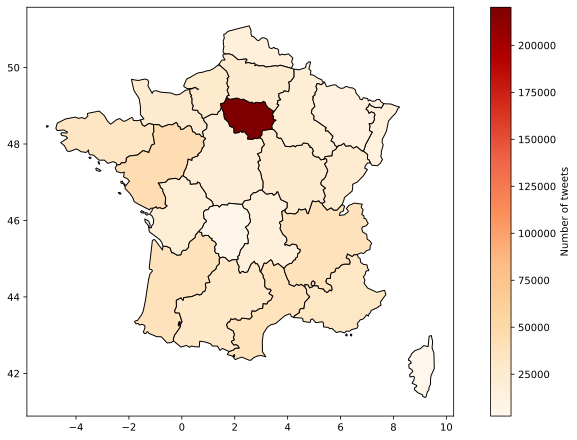

#### Italy
Duplicate cities removed: Comano, Muzzano, Rossa, Villeneuve, 

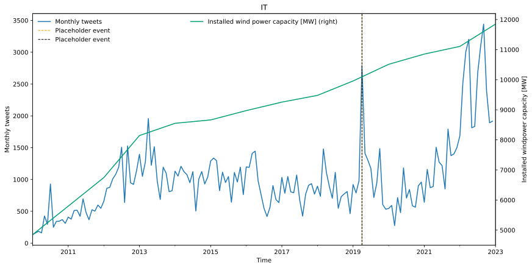
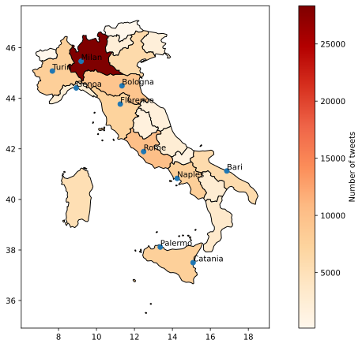

#### Norway
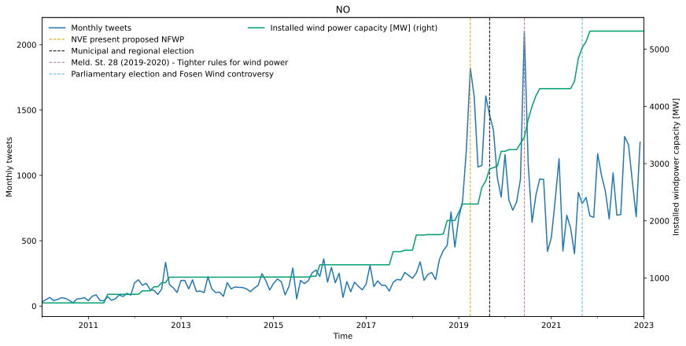
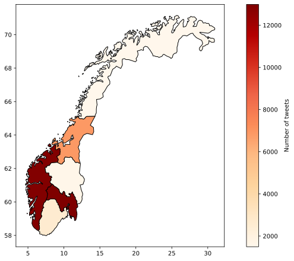

#### Switzerland
Duplicate cities removed in German: Buch, Burg, Büren, Burgdorf, Cham, Endingen, Feldbach, Felsberg, Fischbach, Fürstenau, Fürstenberg, Homberg, Horn, Koblenz, Laufen, Laufenburg, Lindau, Müllheim, Münsingen, Oberhof, Oberkirch, Olsberg, Rain, Reichenau, Rheinau, Rheinfelden, Rothenburg, Schlierbach, Schongau, Schwarzenberg, Stans, Stein, Steinach, Waldenburg, Waldkirch, Wildberg, 

Duplicate cities removed in French: Champagne, Châtillon, Dizy, Gy, Hochfelden, Jussy, La Chaux, La Ferrière, Le Châtelard, Leimbach, Lens, Lignières, Montfaucon, Orges, Rochefort, Rougemont, Rue, Trun,

Duplicate cities removed in Italian: Brione, Castro, Châtillon, Prato, Vernate,
